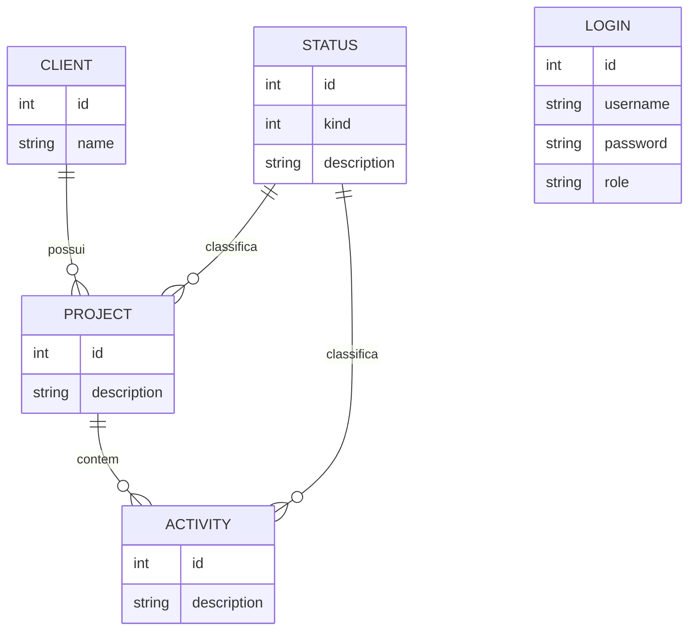
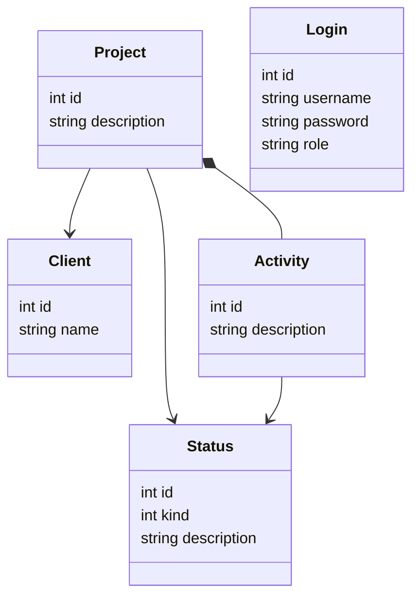

# Diagrama de Backend

Este diagrama representa o modelo de dados do sistema.

## Modelo Entidade-Relacionamento

```mermaid
erDiagram
    CLIENT ||--o{ PROJECT : possui
    STATUS ||--o{ PROJECT : classifica
    STATUS ||--o{ ACTIVITY : classifica
    PROJECT ||--o{ ACTIVITY : contem

    CLIENT {
        int id
        string name
    }
    PROJECT {
        int id
        string description
    }
    ACTIVITY {
        int id
        string description
    }
    STATUS {
        int id
        int kind
        string description
    }
    LOGIN {
        int id
        string username
        string password
        string role
    }
```

## Diagrama de Classes

```mermaid
classDiagram
    class Client {
        int id
        string name
    }
    class Project {
        int id
        string description
    }
    class Activity {
        int id
        string description
    }
    class Status {
        int id
        int kind
        string description
    }
    class Login {
        int id
        string username
        string password
        string role
    }

    Project --> Client
    Project --> Status
    Project *-- Activity
    Activity --> Status
```
