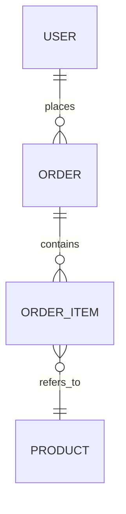
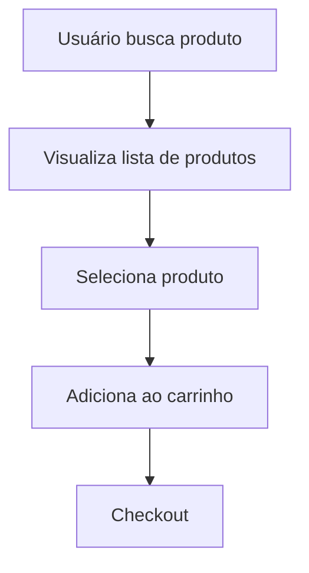

# Diagramas

## Diagrama ER

```mermaid
erDiagram
    USER ||--o{ ORDER : places
    ORDER ||--o{ ORDER_ITEM : contains
    ORDER_ITEM }o--|| PRODUCT : refers_to
```

## Fluxo do Usuário

```mermaid
flowchart TD
    A[Usuário busca produto] --> B[Visualiza lista de produtos]
    B --> C[Seleciona produto]
    C --> D[Adiciona ao carrinho]
    D --> E[Checkout]
```
